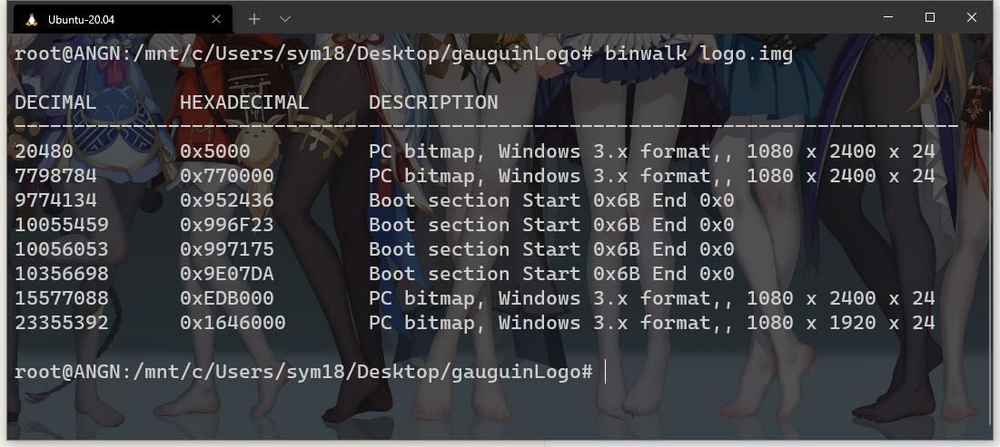

# gauguinLogo
### 这是一个修改开机第一屏的教程
1.首先利用binwalk工具分析logo.img文件,binwalk需要python，ubuntu可直接用apt来安装
``` shell
binwalk logo.img
```


2.提取位图文件，利用dd命令提取

``` shell
dd if=logo.img of=./bmp/1.bmp bs=1 skip=20480 count=7776054
```

- 这里解释一下dd命令的参数
- bs=#： block size, 复制单元大小
- count=#：复制多少个bs
- of=file 写到所命名的文件而不是到标准输出
- if=file 从所命名文件读取而不是从标准输入
- bs=size 指定块大小（既是ibs也是obs)
- ibs=size 一次读size个byte
- obs=size 一次写size个byte
- cbs=size 一次转化size个byte
- skip=blocks 从开头忽略blocks个ibs大小的块
- seek=blocks 从开头忽略blocks个obs大小的块
- count=n 只拷贝n个记录
>后面的count字节怎么来的？其实是这么算的 1080 x 2400 x 3 +54 (长 x 宽 x 3 + 54)
>

3.修改图片

>记住你修改的图片不能大于>原位图字节
>修图任君灵感

4.替换图片

``` shell
dd if=logo.img of=./bmp/1.bmp bs=1 skip=20480 count=7776054
```
>要注意的是备份一份logo文件
>skip参数是要跳过的块

5.最后说明

>刷入logo可以直接用fastboot来刷
>fastboot flash logo logo.img
>脚本可以借鉴编写好的if.sh等文件
